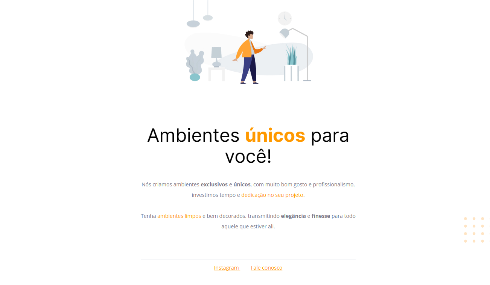

# Corrigindo bugs (01) 👀

## 💻 Sobre o desafio

Nesse desafio, recebir um código com o projeto desenvolvido durante as aulas da Fase 01. O código sofreu algumas alterações mostradas na imagem abaixo.

 

 

Desafio era não olhar a resposta para fortalecer alguns conceitos aprendidos na aula, entre eles:

- Estruturação de um projeto HTML;
- Uso de tags HTML mais comuns;
- Conceitos iniciais de CSS;
- Posicionamento e alinhamento de elementos na tela;
- Aplicação de fontes customizadas;
- Espaçamentos.

## Layout da aplicação resolvida

 

 

[**Link do projeto.**](https://movelcustomizado.netlify.app/)

[**Link do Figma aqui**](https://www.figma.com/file/fAvYZz4dPV5MfhL77XkqkD/Explorer---Stage-01).

 **Participe da  [comunidade aberta](https://discord.gg/Ns86RQyVH8) da Rocketseat 👋**