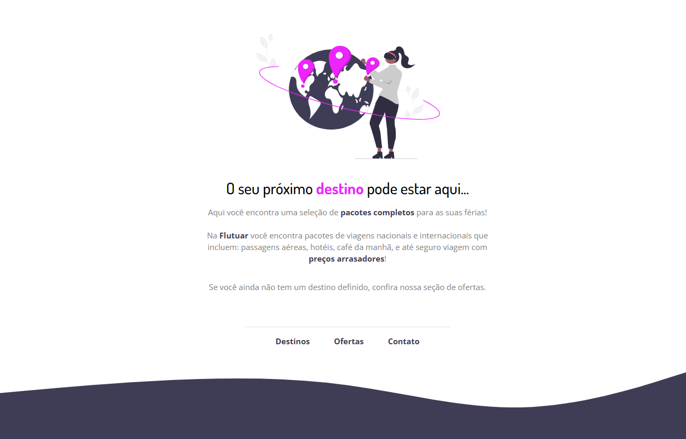

# Projeto extra 01 - Recriando layout

## 💻 Sobre o desafio

 

Nesse desafio, foi preciso recriar uma aplicação, a partir de um layout pronto no Figma, para fortalecer alguns conceitos aprendidos no stage, entre eles:

- Estruturação de um projeto HTML;
- Uso de tags HTML mais comuns;
- Conceitos iniciais de CSS;
- Posicionamento e alinhamento de elementos na tela;
- Aplicação de fontes customizadas;
- Espaçamentos.

 

## Layout da aplicação resolvida

 

 

[**Link do projeto.**](https://flutuarpontocom.netlify.app/)

 **Participe da  [comunidade aberta](https://discord.gg/Ns86RQyVH8) da Rocketseat 👋**