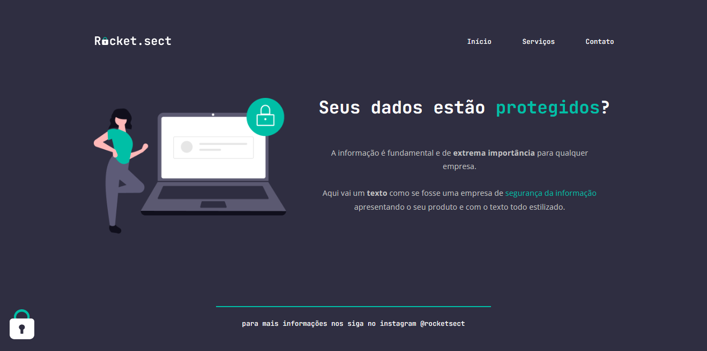

# Recriando layout

## 💻 Sobre o desafio

 

Nesse desafio tive que recriar uma aplicação a partir de um layout para treinar o que aprendi até agora no Stage 02.

 

## Layout da aplicação resolvida

 

 

[**Link do projeto.**](https://rocketpontosect.netlify.app/)

 **Participe da  [comunidade aberta](https://discord.gg/Ns86RQyVH8) da Rocketseat 👋**