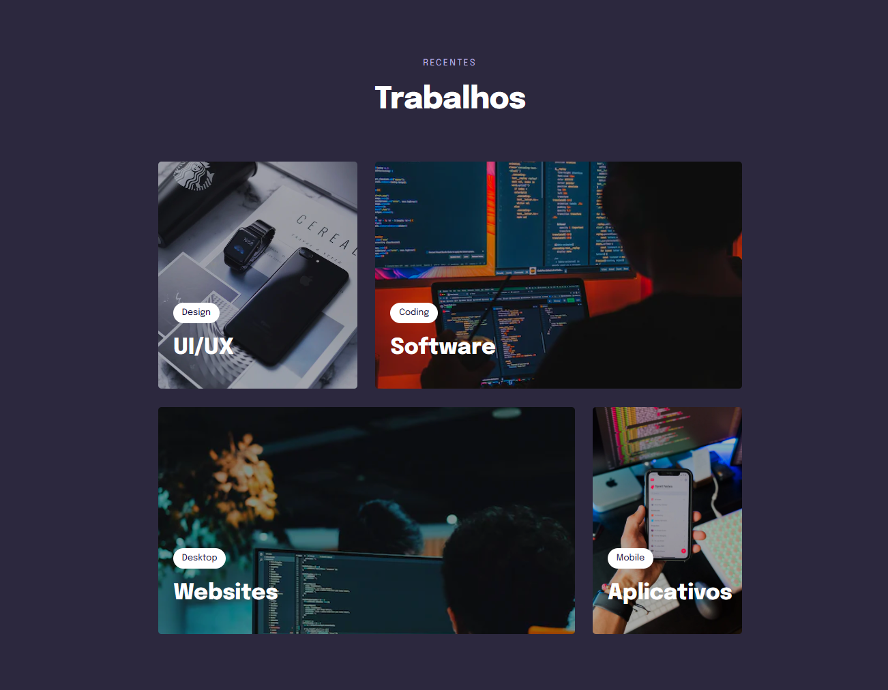

<h1 align="center"> Stage 03 - Componentes </h1>

  <a href="#-tecnologias">Tecnologias</a>&nbsp;&nbsp;&nbsp;|&nbsp;&nbsp;&nbsp;
  <a href="#-projeto">Desafio</a>&nbsp;&nbsp;&nbsp;|&nbsp;&nbsp;&nbsp;

 

  

    
  

  
  <video width="100%" height="auto" controls>
    <source src="assets/video/layouts.mp4" type="video/mp4">
  </video>

## 🚀 Tecnologias

Esse projeto foi desenvolvido com as seguintes tecnologias:

- HTML e CSS
- Git e Github
- Figma

## 💻 Desafio

Fortalecer alguns conceitos aprendidos no Stage 03, entre eles:

- Regra mobile-first;
- Unidades de medidas relativas;
- breakpoints @media ;
- variáveis no CSS;
- cores utilizando HSL;
- transições e transformações no CSS;
- animações no CSS;
- Grid Layout;
- filtros em imagens no CSS;

 

[Acesse o projeto finalizado, online](https://stagecomponents.netlify.app/)

**Participe da  [comunidade aberta](https://discord.gg/Ns86RQyVH8) da Rocketseat 👋**