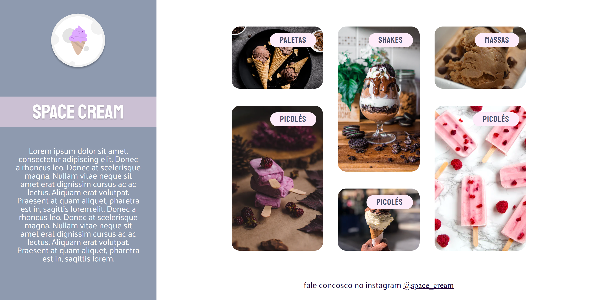

<h1 align="center"> Stage 03 - Mobile First </h1>

  <a href="#-tecnologias">Tecnologias</a>&nbsp;&nbsp;&nbsp;|&nbsp;&nbsp;&nbsp;
  <a href="#-projeto">Desafio</a>&nbsp;&nbsp;&nbsp;|&nbsp;&nbsp;&nbsp;

 

  

    
  

## 🚀 Tecnologias

Esse projeto foi desenvolvido com as seguintes tecnologias:

- HTML e CSS
- Git e Github
- Figma

## 💻 Desafio

Fortalecer alguns conceitos aprendidos no Stage 03, entre eles:

- Mobile First;
- Unidade de medida flexível;
- Animações simples.
- variáveis no CSS;
- cores utilizando HSL;
- transições e transformações no CSS;
- Grid Layout;

 

[Acesse o projeto finalizado, online](https://spacecreamm.netlify.app/)

**Participe da  [comunidade aberta](https://discord.gg/Ns86RQyVH8) da Rocketseat 👋**