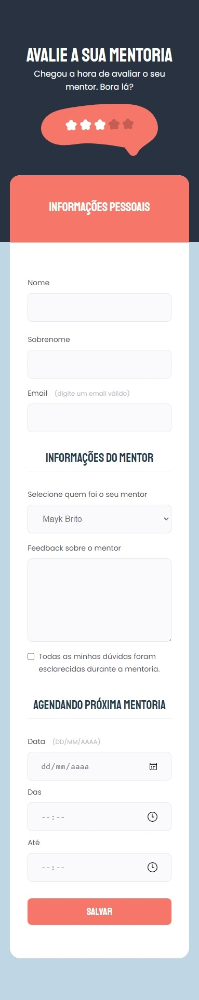
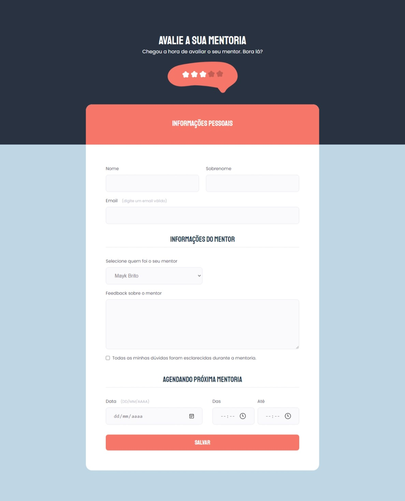

<h1 align="center"> Stage 03 - Formulário Avançado </h1>

  <a href="#-tecnologias">Tecnologias</a>&nbsp;&nbsp;&nbsp;|&nbsp;&nbsp;&nbsp;
  <a href="#-projeto">Desafio</a>&nbsp;&nbsp;&nbsp;|&nbsp;&nbsp;&nbsp;

 

  

    
  

  

    
  

## 🚀 Tecnologias

Esse projeto foi desenvolvido com as seguintes tecnologias:

- HTML e CSS
- Git e Github
- Figma

## 💻 Desafio

Fortalecer alguns conceitos aprendidos na aula, entre eles:

- Agrupamentos de campos com fieldset e legend;
- Funcionamento dos formulários no HTML;
- Campo select;
- Campo checkbox;
- Imagem centralizada no header;
- Validação de campos;

 

[Acesse o projeto finalizado, online](https://advancedform2.netlify.app/)

**Participe da  [comunidade aberta](https://discord.gg/Ns86RQyVH8) da Rocketseat 👋**